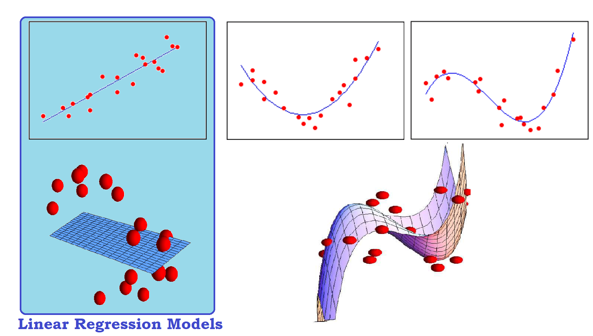
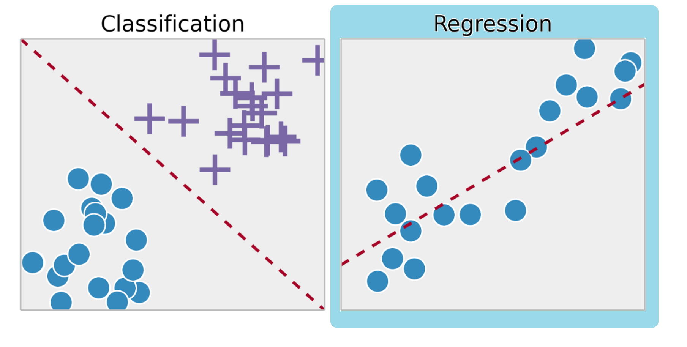
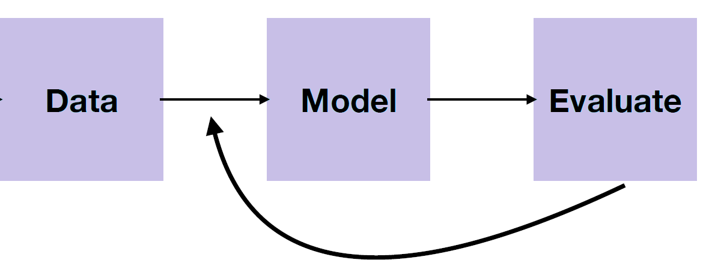

```{r setup, include=FALSE}
knitr::opts_chunk$set(echo = FALSE)
```
## Introduction

Regression Analysis: Statistical method that allows the exploration of the relationship between two or more variables.
{ width=80% }\


## Introduction

- $Y:$ Response, outcome, output, dependent variable.
- $(X_1, ...X_p)^T:$ vector of predictors, inputs, independent or explanatory variables.

Goals:

1. Prediction of future or unmeasured responses given values of the predictors.
2. Assessment of the effect/relationship between explanatory variables and response. Existence of causality?

## Cars example
```{r, echo = F}
helpfile <- utils:::.getHelpFile(help(cars))
tools:::Rd2HTML(helpfile, out ="cars.html")
``` 
[Link to help](./cars.html)

$X:$ Speed $\qquad Y:$ Distance
```{r cars1, fig.width=3.2,fig.height=1.9, echo = TRUE}
par(mar=c(3,4,0.5,1))
plot(cars, pch=18)
```

## Cars example
$X:$ Speed $\qquad Y:$ Distance
```{r cars2, fig.width=3.2,fig.height=1.9, echo = TRUE}
par(mar=c(3,4,0.5,1))
plot(cars, pch=18)
abline(lm( dist ~ speed, data=cars), col="blue")
```

## Cheddar example
```{r, echo = F}
library(faraway)
helpfile <- utils:::.getHelpFile(help(cheddar))
tools:::Rd2HTML(helpfile, out ="cheddar.html")
``` 
[Link to help](./cheddar.html)

$X:$ Hydrogen sulfide concentration $\qquad Y:$ Taste score
```{r che1, fig.width=3.2,fig.height=1.9, echo = TRUE}
library(faraway)
par(mar=c(3,4,0.5,1))
plot(cheddar$H2S, cheddar$taste, pch=18)
```

## Cheddar example
$X:$ Hydrogen sulfide concentration $\qquad Y:$ Taste score
```{r che2, fig.width=3.2,fig.height=1.9, echo = TRUE}
library(faraway)
par(mar=c(3,4,0.5,1))
plot(cheddar$H2S, cheddar$taste, pch=18)
abline(lm( taste ~ H2S, data=cheddar), col="blue")
```

## Pressure example
```{r, echo = F}
helpfile <- utils:::.getHelpFile(help(pressure))
tools:::Rd2HTML(helpfile, out ="pressure.html")
``` 
[Link to help](./pressure.html)

$X:$ Temperature $\qquad Y:$ Pressure
```{r pre1, fig.width=4,fig.height=1.9, echo = TRUE}
par(mar=c(3,4,0.5,1))
plot(pressure, pch=18)
```


## Pressure example
$X:$ Temperature $\qquad Y:$ Pressure
```{r pre2, fig.width=4,fig.height=1.9, echo = TRUE}
par(mar=c(3,4,0.5,1))
plot(pressure, pch=18)
abline(lm( pressure ~ temperature, data=pressure), col="red")
```


## Regression vs Classification

- Regression: $Y$ is continuous. Numerical values (e.g. price, blood pressure, confirmed COVID-19 cases).
- Classification $Y$ discrete labels. Categorical values. (e.g. survived/died, digit 0-9, if Bitcoin price is going up tomorrow).

\centering
{ width=60% }\


## General Workflow

\centering
{ width=60% }\
1. Data: We collect data for all $n$ subjects in the study, and identify $Y$ and $X$:

$$ Y = \begin{bmatrix}
           y_{1} \\
            \\
                  \\
         \end{bmatrix}  \qquad \qquad  X = \begin{bmatrix}
           x_{11}& x_{12} &...&x_{1p}\\
          &&&\\
           & & &
         \end{bmatrix} $$

## General Workflow

\centering
{ width=60% }\
1. Data: We collect data for all $n$ subjects in the study, and identify $Y$ and $X$:

$$ Y = \begin{bmatrix}
           y_{1} \\
           y_{2} \\
                  \\
         \end{bmatrix}  \qquad \qquad  X = \begin{bmatrix}
           x_{11}& x_{12} &...&x_{1p}\\
           x_{21}& x_{22} &...&x_{2p} \\
           & & &
         \end{bmatrix} $$


## General Workflow

\centering
{ width=60% }\
1. Data: We collect data for all $n$ subjects in the study, and identify $Y$ and $X$:

$$ Y = \begin{bmatrix}
           y_{1} \\
           y_{2} \\
           \vdots \\
           y_{n}
         \end{bmatrix}  \qquad \qquad  X = \begin{bmatrix}
           x_{11}& x_{12} &...&x_{1p}\\
           x_{21}& x_{22} &...&x_{2p} \\
           \vdots &\vdots& ...&\vdots\\
           x_{n1}& x_{n2} &...&x_{np}
         \end{bmatrix} $$
         
- $Y \in \mathbb{R}^{n}$, $X \in \mathbb{R}^{n \times p}$

## Regression Model 


$$Y= f(X_1, X_2, ...X_p) + \epsilon$$

- $\epsilon:$ Error/noise
- $f$ is unknown and must be learned from observations $(Y, X_1, ..., X_p)$
- Questions about $f$. Continuous? Smooth?
- $f$ must be restricted. In this course: We assume $f$ is linear.

## Linear Regression Model

We assume the response is written as linear representation of predictors:

$$Y = \beta_0 + \beta_1X_1+...\beta_pX_p + \epsilon$$

- **Estimation:** The goal is to estimate unknown parameters $\beta_0, \beta_1, ...\beta_p$. 

## Linear Regression Model

- **Linear:** $$Y = \beta_0 + \beta_1 log(X_1)+...\beta_pX_p^2 + \epsilon = \beta_0 + \beta_1 W_1+...\beta_pW_p + \epsilon $$

- **NOT Linear:** $$Y = \beta_0 +  X_1^{\beta_1}+...\beta_pX_p + \epsilon$$

## Matrix Representation

$$\begin{bmatrix}
           y_{1} \\
           y_{2} \\
           \vdots \\
           y_{n}
         \end{bmatrix}  = \begin{bmatrix}
           1& x_{11} &...&x_{1p}\\
           1& x_{21} &...&x_{2p} \\
           \vdots &\vdots& ...&\vdots\\
           1& x_{n1} &...&x_{np}
         \end{bmatrix}  \begin{bmatrix}
           \beta_{0} \\
           \beta_{1} \\
           \vdots \\
           \beta_{p}
         \end{bmatrix} +  \begin{bmatrix}
           \epsilon_{1} \\
           \epsilon_{2} \\
           \vdots \\
           \epsilon_{n}
         \end{bmatrix}$$
         
         
  $$ Y = X\beta + \epsilon$$

## Model Assessment

1. Prediction: accurately predict future response given predictors.
2. Inference: assess the quality of our predictions and (or) estimation.
3. Diagnostics: what if the linear model assumptions go wrong? how can we tell?
4. Model selection: find the "best" linear model for response given predictors.


## Next...

- Set up your R working environment.
- Lab sessions and TAs’ office hours start next week.
- Office hours:
  - Prof. Baracaldo: TBD
  - Prof. Targino: Fridays 1.30pm - 3.30pm OG1230 or on Zoom \url{https://fgv-br.zoom.us/j/95030256507}


